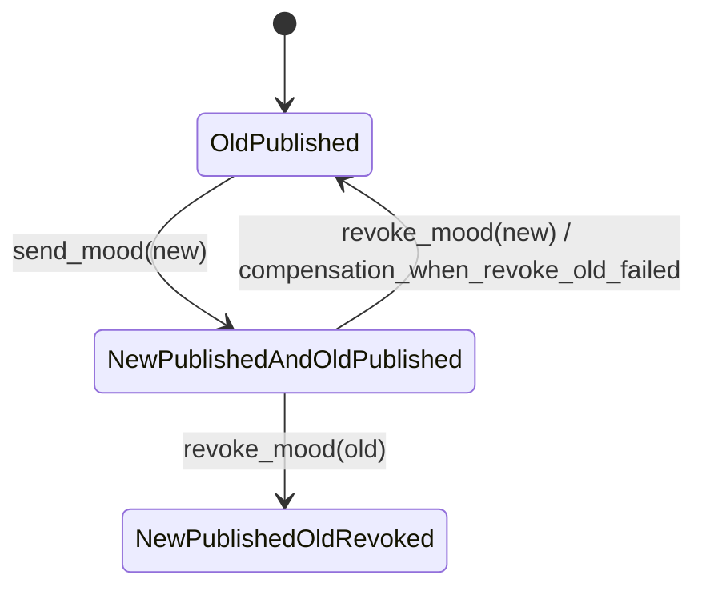

单条心情记录”的生命周期状态机：```mermaid
stateDiagram-v2
    [*] --> Absent
    Absent --> Published : send_mood
    Published --> Published : list_mood (read-only)
    Absent --> Absent : list_mood (read-only)
    Published --> Revoked : revoke_mood
    Revoked --> Revoked : list_mood (通常默认不返回，或视为已失效)
    Revoked --> [*]
```


这个图直接解释了可回滚性：
send_mood 可回滚：创建成功后，可以再执行一次 revoke_mood(new_id) 做补偿。
revoke_mood 不可回滚：APP 没有“恢复已撤销记录”的接口。
list_mood 只读，不改变状态，因此天然可逆。